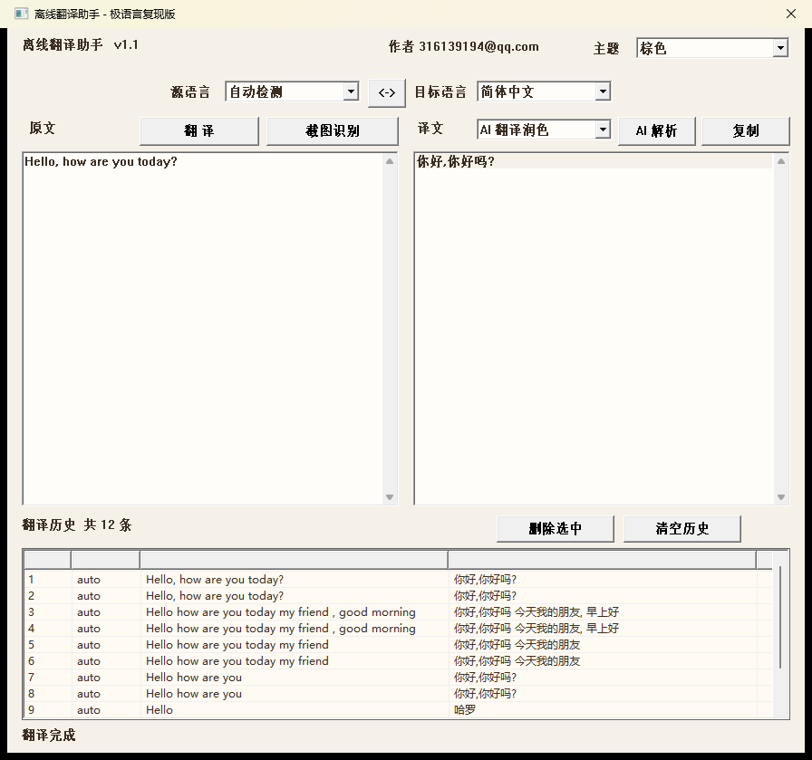

# 离线翻译助手 · 极语言复现版

用 **极语言（SEC / Sc.exe 中文编译型语言）** 复现 aardio 工程
`C:\Users\lvshan\aardio\project\离线翻译工具`（离线翻译助手 v1.1）。

前端界面、交互、翻译／AI／历史／**输入即译／截图识别／整套主题换色** 全部由极语言实现；
**翻译引擎原封不动复用** 原工程的 Python 引擎
（CTranslate2 翻译模型 + PaddleOCR + Qwen2-0.5B + SQLite 历史库）。



> 本文档 §5 的三条历史遗留限制（防抖定时器崩、OCR 未实现、主题只换状态文字）
> **本轮已全部做完**，对应实现与验证见 §5、§9。

---

## 1. 快速开始

```
D:\SEC\project\ji-offline-translator\
    离线翻译助手.exe      ← 双击运行（873 KB）
    bridge.py             ← 极语言 <-> Python 引擎 的桥
    engine\               ← 原工程的 Python 引擎（目录联接，指向原 dist\engine）
    src\translator.txt    ← 极语言源码（UTF-8，构建时自动转 GBK+CRLF）
    tools\                ← 构建 / 自动化实测脚本（见 §9）
    shots\                ← 运行截图
```

双击 `离线翻译助手.exe` 即可。程序会自动：

1. 用 `CreateProcess` 启动 `engine\python.exe bridge.py`；
2. 轮询 `bridge_port.txt` 拿到监听端口；
3. 之后所有翻译／AI／OCR／历史请求都通过本地 TCP 发给它。

重新编译源码（**推荐**，源码是 UTF-8，脚本自动生成 GBK+CRLF 临时副本）：

```powershell
powershell -File D:\SEC\project\ji-offline-translator\tools\build.ps1
```

---

## 2. 功能对照（原 aardio 版 → 极语言版）

| 功能 | 原 aardio 版 | 极语言复现版 | 状态 |
|---|---|---|---|
| 主界面布局（标题栏/语言栏/双卡片/历史区/状态栏） | win.form + plus/bkplus | `创建窗口` + Static/Button/Edit/ComboBox/SysListView32 | ✅ |
| 源/目标语言下拉、自动检测 | combobox | combobox（`$50210003`） | ✅ |
| **输入即译（600ms 防抖）** | `inputText.onKeyUp` + `setTimeout` | `EN_CHANGE` → `设置定时(窗体,101,600,0)` → `为 定时事件` 分支 | ✅ |
| 英→中 / 中→英 / 自动方向 | `translate` + `auto_dir` | 同；切换语言下拉会清空“上次原文”并重新排定翻译 | ✅ |
| 交换语言 | `swapBtn` | `<->` 按钮 | ✅ |
| 复制译文到剪贴板 | `win.clip.write` | `全局分配/全局锁定/写剪切板` | ✅ |
| 翻译历史（SQLite） | listview + 双击详情 | SysListView32（LVM_* 消息）+ 删除／清空 | ✅ |
| AI 解析（7 种任务） | Qwen2-0.5B + `thread.invoke` | 同引擎；卡片右侧任务下拉 + `AI 解析` 按钮 | ✅ |
| **主题切换（棕/深蓝/多彩）** | 整套 plus/edit/listview 换色 | `擦除背景` + `绘制静态/绘制编辑/绘制列表` + LVM 颜色消息（见 §5.1） | ✅ |
| **截图识别翻译** | `mouse.screenArea` + dotNet.ocr | 自建全屏框选窗 + GDI 抓屏 + 写 BMP + 引擎 `ocr_translate`（见 §5.2） | ✅ |

实测（截图 `shots/working.png`、`shots/ai.png`、`shots/ocr-e2e.png`）：

```
输入：Hello, how are you today?
CTranslate2 译文：你好,你好吗?
AI 翻译润色    ：你好，今天怎么样？          ← Qwen2-0.5B
截图识别       ：框选屏幕任意区域 → 识别 25 字 → 同上译文，并写入历史
输入即译       ：打字停顿 600ms 自动翻译；连续 6 轮压测不崩（shots/debounce-stress.png）
```

---

## 3. 架构

```
┌──────────────────────── 极语言 GUI（离线翻译助手.exe） ────────────────────────┐
│  窗体 / 控件 / 列表视图 / 剪贴板 / 定时器防抖 / 全屏框选窗 / GDI 抓屏           │
│  JSON 只“构造”不“解析”  →  写成 GBK 文本                                       │
│  Winsock：网络启动 → 分配 → 连网 → 发送 → 接收                                │
└───────────────────────────────┬───────────────────────────────────────────────┘
                                │  裸 TCP：8 字节 ASCII 长度 + UTF-8 JSON
                                ▼
┌──────────────────────── bridge.py（新增，约 190 行） ──────────────────────────┐
│  解析请求 → import service → 调用原引擎函数 → 结果转纯文本                     │
│  响应：8 字节 ASCII 长度 + UTF-8 纯文本                                        │
└───────────────────────────────┬───────────────────────────────────────────────┘
                                │  直接调用（未修改原文件一行）
                                ▼
┌──────────────────── engine\service.py（原工程，原样复用） ─────────────────────┐
│  CTranslate2 (en_zh / zh_en) · sentencepiece                                   │
│  PaddleOCR 3.x · Qwen2-0.5B-Instruct (transformers + torch) · SQLite history.db │
└───────────────────────────────────────────────────────────────────────────────┘
```

**为什么要加 bridge.py？**
原 aardio 前端用 `web.rest.jsonClient` 直接消费 `service.py` 的 JSON HTTP 接口。
极语言没有 JSON 库，而本版编译器在两处**实测不可靠**：

1. 手写 JSON 解析过程 → 编译产物是**无法加载的 PE**（`CreateProcess` 报 193
   `ERROR_BAD_EXE_FORMAT`，用 `Probe` 反复复现，去掉那两个过程即恢复正常）；
2. 在 GUI 程序里 `发送()` 一个由 `格式化()` 构造的 HTTP 头缓冲 → 恒返回 `-1`，
   而 `发送()` 一个由 `本地转UTF8()` 产生的缓冲却正常。

于是让桥把响应改写成极语言只需「按字节读」的纯文本，业务逻辑一行未改。

---

## 4. 桥协议

请求（客户端一次性发出）：

```
8 字节 ASCII 十进制长度  ||  该长度的 UTF-8 JSON
例：00000070{"cmd":"translate","text":"Hello","auto_dir":true}
```

响应：

```
8 字节 ASCII 十进制长度  ||  该长度的 UTF-8 纯文本
纯文本 = "OK\r\n" + 载荷     或     "ERR\r\n" + 错误信息
```

载荷约定：

| cmd | 载荷 |
|---|---|
| `translate` | 译文 |
| `ai` | AI 回答 |
| `history_add` | 记录 id |
| `history_list` | 每行 `id\tdir\tsource\ttarget` |
| `history_delete` / `history_clear` | `1` |
| `ocr_translate` | `<原文>\n\x1e\n<译文>` |
| `ai_tasks` | 每行 `key\t显示名` |

> `ocr_translate` 的 `img` 字段由极语言端填 **GBK 本地路径**，
> 经 `本地转UTF8` 整体转码后由 Python 按 UTF-8 解出——所以路径里的反斜杠
> **必须走 `报转义`**，否则桥端抛 `JSONDecodeError: Invalid \escape`（见 §6 #16）。

---

## 5. 上一轮的三条限制：本轮怎么做的

### 5.1 输入即译 600ms 防抖（原限制 1）

**根因（本轮定位）**：崩溃不在业务代码，而在 `设置定时` 的第 4 个参数。
把**过程地址**传给它（`设置定时(窗体,0,600,@过程)`）时，编译器生成的 TIMERPROC
蹦床与 USER32 的调用约定/清栈方式不匹配，栈指针被逐次搞坏，
若干次回调后必然 `0xC0000409`（STATUS_STACK_BUFFER_OVERRUN）。

**最小复现**（`src\_lab\tm5.txt`）：窗口 + 一个 500ms 定时器，回调只加计数——
12 秒内必崩。

**正确写法**（`src\_lab\tm4.txt` 12 秒计数 29、进程存活）：

```ji
设置定时(窗体,号_防抖,600,0);      // ★ 第 4 参数写 0，不注册回调
...
程序 窗体消息(窗口,消息,参数,数据)
	判断(消息)
	为 定时事件{防抖翻译}          // 标准 WM_TIMER，由消息循环分派进来
	...
结束
```

最终实现（`src\translator.txt`）：

```ji
程序 排定翻译                       // 每次 EN_CHANGE 重新计时
	删除定时(窗体,号_防抖);
	设置定时(窗体,号_防抖,600,0);
结束
程序 防抖翻译                       // WM_TIMER 到点：删定时 + 翻译
	删除定时(窗体,号_防抖);
	立即翻译;
结束
程序 输入框通知(通知)
	如果(通知=$300){排定翻译}        // EN_CHANGE = 0x300
结束
```

- 打字停顿 600ms 即自动翻译；继续打字则重新计时（真正的 debounce）。
- 语言下拉变更 → `换向翻译`（清空“上次原文”，同一段文字会按新方向重译）。
- 开始截图框选时会先 `删除定时`，避免选区过程中插入一次翻译。
- 压测：连续 6 轮“打字—停顿”，约 40 秒，进程存活、译文正确
  （`shots/debounce-stress.png`）。

### 5.2 截图识别（原限制 2）

全流程实现了，模块都在 `src\translator.txt`：

| 步骤 | 实现 |
|---|---|
| 全屏框选窗 | `创建窗口($80088,程序.名称,"",$80000000,系左,系上,屏宽,屏高,0,0,0,0)`（`WS_EX_LAYERED\|TOPMOST\|TOOLWINDOW` + `WS_POPUP`），`设置透明(截图窗,0,120,2)` 做半透明遮罩 |
| 鼠标框选 | `WM_LBUTTONDOWN/MOUSEMOVE/LBUTTONUP`（**坐标在 `数据`(lParam)**）+ `捕获鼠标`/`释放鼠标`；右键 `WM_RBUTTONDOWN` 取消 |
| 选区绘制 | `取设备` + `填充矩形`(遮罩/选区提亮) + `画矩形框`(描边) + `写字到`(提示语) |
| 抓屏 | 隐藏框选窗 → `延时(300)` → `取设备(0)`/`创建设备`/`创建图像`/`位图传输(SRCCOPY)` |
| 存 BMP | `设备位图`(GetDIBits) **逐行**取 24bpp 像素写文件，手写 14 字节文件头 + 40 字节信息头（BMP 每行 4 字节对齐） |
| 识别+翻译 | `{"cmd":"ocr_translate","img":<转义后的路径>,"dir":...}` → 载荷按 `\x1e` 拆成原文/译文 → 分别写原文框、译文框、写历史、刷列表 |

- 抓屏文件固定写到 `<程序目录>\ocr_capture.bmp`（**纯 ASCII 路径**，见 §5.5）。
- 用**逐行 GetDIBits + 9.6 KB 行缓冲**而不是一次性大缓冲：极语言的全局
  `文本` 数组会进 PE 数据段（实测 1 MB 数组 → exe 涨 1 MB），
  一次性缓冲会让 exe 膨胀十几 MB。
- 选区上限 3200×1080（缓冲与屏幕上限），超过会被裁剪。
- 框选窗**只建一次、反复复用**；右键取消走 `取消截图`。实测连续
  「取消 → 取消 → 框选识别」三次调用拿到同一个 hwnd，进程稳定。

实测（`tools\ocr-test.ps1` 全自动：造一个白底大号文字的窗口 → 点“截图识别” →
发真实鼠标消息框选 → 等 OCR）：

```
cancel #1: overlay=8979612 status='已取消截图识别'      ← 右键取消
cancel #2: overlay=8979612 status='已取消截图识别'      ← 窗口复用（同一 hwnd）
overlay rect=0,0-3200,1080                            ← 覆盖整个虚拟桌面（双屏）
status = 截图识别完成（识别 25 字）
input  = Hello, how are you today?
output = 你好,你好吗?
```

截图：`shots/ocr-overlay.png`（框选态，遮罩+选区；用 `PrintWindow` 单独抓框选窗，
因为 `CopyFromScreen` 抓不到分层窗口）、`shots/ocr-e2e.png`（识别结果）。

### 5.3 主题整套换色（原限制 3）

| 对象 | 手段 |
|---|---|
| 窗体背景 | `为 擦除背景{返回(擦背景(参数))}`（`$0014`，wParam 就是 DC）→ `填充矩形` 主题画刷 |
| Static / Edit / 下拉列表 | `为 绘制静态/绘制编辑/绘制列表{返回(背景刷*)}`（`$0138`/`$0133`/`$0134`）→ `改背景色`+`文本改色`，返回主题画刷 |
| SysListView32 | `LVM_SETBKCOLOR($1001)` / `LVM_SETTEXTBKCOLOR($1026)` / `LVM_SETTEXTCOLOR($1024)` |
| 重绘 | `重绘矩形(控件,0,1)`（InvalidateRect）逐个控件失效 |
| 配色 | COLORREF = `$00BBGGRR`，三套色板写在 `建主题画刷(序)`，切换时 `删除对象` 旧画刷防泄漏 |

三套主题实测截图：`shots/theme-0.png`（棕）、`shots/theme-1.png`（深蓝）、
`shots/theme-2.png`（多彩）。运行时校验（`tools\theme-test.ps1` 直接读 LVM 颜色）：

```
theme 0  LVM_BK=0xF2FAFF LVM_TX=0x222E3A
theme 1  LVM_BK=0x3A3028 LVM_TX=0xF0E6E0
theme 2  LVM_BK=0xFFFFFF LVM_TX=0x282020
```

---

## 6. 仍然存在的差异 / 限制

1. **按钮不跟着换色**。标准 `Button` 不受 `WM_CTLCOLORBTN` 影响
   （系统只对 owner-draw 按钮使用返回的画刷），所以“翻译/截图识别/AI 解析/复制/
   删除选中/清空历史/<->”保持系统外观。要做整套皮肤需要 `BS_OWNERDRAW` +
   `WM_DRAWITEM` 自绘，工作量另计。
2. **选区遮罩是整窗半透明（LWA_ALPHA=120）**，不是「选区外变暗、选区内原色」的
   挖洞效果。挖洞要用颜色键（LWA_COLORKEY）+ 自绘，或者两次抓屏合成。
3. **框选窗覆盖虚拟桌面**（本机 3200×1080，主屏 1920×1080 + 副屏 1280×800）；
   单次选区上限 3200×1080。
4. **首次截图识别较慢**：PaddleOCR 首次要载模型，状态栏停在“正在抓屏识别，请稍候...”，
   没有进度条（实测首次约 20~60 秒，之后 2~4 秒）。
5. 历史删除需要先在列表里选中行（LVM 多选），逻辑已实现。
6. 原工程 `engine\` 里缺 `python313.zip`（stdlib），运行时用的是
   `dist\engine\`（完整）。本工程的 `engine` 是指向 `dist\engine` 的**目录联接**。
7. **引擎目录必须是纯 ASCII 路径**。sentencepiece 的 C++ 层用 ANSI 打开模型文件，
   路径含中文（如 `…\离线翻译工具\…`）会 `NOT_FOUND` 直接失败——
   这也是原工程在本机跑不起来翻译的根因。故本工程放在 `D:\SEC\project\ji-offline-translator\`。

---

## 7. ★ 极语言（SEC）实测踩坑清单

复现过程中踩到并已复现验证的坑，按危害排序（对后续极语言项目通用）。
**#1~#16 本轮新增/复验，#17 起为上一轮结论。**

| # | 现象 | 根因 / 正确写法 |
|---|---|---|
| 1 | 定时器跑几秒后必 `0xC0000409`（栈缓冲溢出） | ★ **`设置定时` 第 4 参数传过程地址会坏栈**（TIMERPROC 蹦床调用约定不匹配）。写 `设置定时(窗口,编号,毫秒,0)`，再用 `为 定时事件` 分支处理；最小复现 `src\_lab\tm5.txt`、正确写法 `src\_lab\tm4.txt` |
| 2 | 编译报 `语法有误 + 内部错误`，且**报错行号比真正出错行小 1~2 行**，看着像别处的错 | ★ 把**消息常量当函数调用**。例：`显示窗口` 是 `WM_SHOWWINDOW($0018)` 常量，`ShowWindow` 的中文名是 **`显隐窗口`**；`显示窗口(窗体,0)` 会让整段代码以奇怪的行号报错。查名字务必对 `D:\SEC\inc\lib\*.lib`（`英文名,参数个数,中文名`） |
| 3 | 鼠标坐标永远是 0 / 选区判定“太小” | ★ `窗体消息(窗口,消息,参数,数据)` 里 **`参数`=wParam、`数据`=lParam**；鼠标坐标在 `数据` 里（低位 x、高位 y，需按 16 位有符号处理） |
| 4 | `如果(a){如果(b){c};返回(0)}` 报 `语法有误 + 内部错误` | ★ 不要在 `如果` 体内**再嵌 `如果` 之后还跟语句**；把内层判断拆成独立 `程序`（`输入框通知`/`下拉通知` 就是这么来的） |
| 5 | 过程名与全局变量同名时整段解析崩 | ★ 例如既有 `整数 刷窗体;` 又写 `程序 刷窗体(...)` → 改名（`背景刷窗体`）即可 |
| 6 | 桥端报 `JSONDecodeError: Invalid \escape` | ★ JSON 里放 Windows 路径必须走 `报转义`（它转义 `"`、`\` 和换行），不能直接 `报文字` |
| 7 | 全局 `文本 大缓冲[10000000];` | ★ 全局文本数组**进 PE 数据段**（实测 1 MB 数组 → exe 涨 1 MB）。大缓冲要么改运行时 `申请内存`，要么像抓屏那样**逐行小块 + 循环** |
| 8 | `获取消息` 里注册过 TIMERPROC 后，`为 定时事件` 分支永远不触发 | 传了非 0 回调时系统**不再投递 WM_TIMER**（这一条与 #1 一起解释了上一轮的“定时器必崩”） |
| 9 | 编译 `BUILD_OK`，但 `CreateProcess` 报 **193 不是有效 Win32 程序** | 特定源码形态（尤其实现在过程里做 JSON 扫描＋嵌套循环）会产出**结构自洽但 Windows 拒绝加载**的 PE。去掉该过程即恢复；换写法/改数据规模可绕开 |
| 10 | 运行期 **`0xC0000005`** | ①在 `如果(…)` **条件里调用自定义过程**；②在自定义过程里对**参数**做指针加减（`参数+n`、`整数-参数`）。都改成先赋值给局部变量 / 用 `格式化` 拼串 |
| 11 | 循环体里 `如果(…)` 再套 `如果(…)`，赋值**静默失效** | `循环 → 如果 → 如果`（3 层）会“编译通过但逻辑悄悄错”。全项目控制在「循环 + 一层如果」，复合条件用标志变量拆开 |
| 12 | `循环(1){…}` 只跑一次 | `循环(n)` 是「重复 n 次」；死循环写 `循环` 或 `循环{…跳出}` |
| 13 | 每个 `程序` 里**局部声明必须写在任何语句之前** | 否则报「未定义的名称」或运行期崩 |
| 14 | `文本变量 ~ 控件` / `控件 ~ 内容` | 这是**读写控件内容的官方写法**（`sec.htm` 第 558 行）。`改控件字(窗体,ID,文本)` 对本项目里的只读多行 Edit 会崩，改用 `控件_输出框 ~ 载荷;` 正常 |
| 15 | `文件写入("字面量",…)` 必崩 | 目标缓冲不能是字面量；先 `内存复制` 到 `文本` 变量 |
| 16 | `模块名称(0,缓冲,512)` | 正常返回路径长度；截断目录时 `缓冲(i+1)=0` **保留**反斜杠，写成 `缓冲(i)=0` 会少一个 `\` |
| 17 | ListView 消息常量 | `LVM_INSERTCOLUMN=0x101B`、`LVM_INSERTITEM=0x1007`、`LVM_GETITEMTEXTA=0x102D`、`LVM_SETITEMTEXTA=0x102E`、`LVM_DELETEALLITEMS=0x1009`、`LVM_GETNEXTITEM=0x100C`、`LVM_SETBKCOLOR=0x1001`、`LVM_SETTEXTCOLOR=0x1024`、`LVM_SETTEXTBKCOLOR=0x1026`（用错常量会直接崩） |
| 18 | 组合框选中项 | 用 `发送消息(控件,$14E,索引,0)`（CB_SETCURSEL）；`$14E` **不会**给父窗口发 CBN_SELCHANGE，要自己补一条 `WM_COMMAND`（自动化测试里就是这么做的） |
| 19 | 读控件文字 | `取控件字(窗体,ID,缓冲,大小)` 与 `发送消息(编辑,$000D,大小,缓冲)` 都可用；本项目统一用 `~` |
| 20 | 编译器偶发 | 同一份源码**反复编译**偶尔产不出可运行产物；本仓库用“编译后校验能否 `CreateProcess`”的方式确认 |
| 21 | `定义 后缀=exe;` 必须放在 `模块文件=` **之后**；`程序类型` / `模块文件` 顺序固定 | 顺序错会报「未定义的名称:模块文件」 |
| 22 | 外部程序用 `SetWindowTextA` 灌入的文字，本进程内 `~` 读不到 | 自动化测试请用 `WM_CHAR` 模拟真实键入（本项目全部用此法验证） |
| 23 | **定位 `语法有误+内部错误` 的方法** | 编译器报错行号不可靠时，用 `tools\brem.ps1`（整过程增删）或 `tools\bz.ps1`（只清空过程体）做二分；把新代码**追加**到已知可编译的基线上并加 `X_` 前缀，能避免「未定义名称」提前中断编译、掩盖真正的解析错误 |

---

## 8. 源码要点（`src\translator.txt`，1248 行）

- 入口是 `程序 加载窗体`（`GUI.inc` 已提供 `程序入口` 与 `读取消息`）。
- 控件 ID 用 `常量 编号_*` 统一管理（`判断(参数 & 65535)` 前先赋值给变量）。
- JSON **只构造**：`报重置 / 报字节 / 报文字 / 报引号 / 报转义`。
- 编码：`本地转UTF8`（GBK→UTF-8，供发送）、`UTF8转本地`（响应转回 GBK）。
- 传输：`发请求` 组装「8 位长度 + JSON」→ `原始发送`（Winsock，单次 send + 循环 recv）。
- 历史：`刷新历史 / 取字段 / 加行 / 选中行数 / 删除选中 / 清空历史`。
- 防抖：`排定翻译 / 防抖翻译 / 换向翻译 / 输入框通知 / 下拉通知`。
- 截图：`取屏幕信息 / 建截图窗 / 截图识别 / 截图消息 / 截图重画 / 执行抓屏 /
  抓屏 / 写图头 / 写四字节 / 识别图片 / 拆分OCR`。
- 主题：`建主题画刷 / 应用主题 / 主题重绘 / 擦背景 / 背景刷窗体 / 背景刷静态 / 背景刷编辑`。

`src\_lab\` 保存了复现过程用到的探针小程序：
`tm3/tm4/tm5`（定时器三种写法对照，tm5 崩 / tm4 稳）、`ocr1`（GDI 抓屏写 BMP 探针），
以及上一轮的 `probe1`、`u1…u6` 等。旧的一次性二分中间产物已清理。
`src\_backup_translator_v1.gbk.txt` 是本轮改造**之前**的源码备份（GBK），便于对照。

---

## 9. 构建与验证工具（`tools\`）

| 脚本 | 作用 |
|---|---|
| `build.ps1` | **主构建**：把 UTF-8 的 `src\translator.txt` 规范化成 GBK+CRLF 的 `src\_build\translator.txt`，调 `sec.ps1` 编译，产物拷成 `离线翻译助手.exe` 和 `src\translator.exe` |
| `gui-test.ps1` | 起程序 → 用 `WM_CHAR` 真实键入（`\|` 表示停顿 2.5s，用来触发防抖）→ 可选点按钮 → 读状态/原文/译文 → 截图；进程退出会打印退出码（`-1073740791` 即 `0xC0000409`） |
| `theme-test.ps1` | 起程序 → 逐个切换主题下拉项（CB_SETCURSEL + 补发 WM_COMMAND）→ 读 `LVM_GETBKCOLOR/LVM_GETTEXTCOLOR` → 每个主题一张截图 |
| `ocr-test.ps1` | 全自动截图识别回归：造一个白底大号文字的窗口 → 点“截图识别”→ 向框选窗发真实鼠标消息画选区 → 轮询状态栏 → 输出原文/译文/截图 |
| `overlay-probe.ps1` | 查框选窗的 `WS_EX_LAYERED/TOPMOST`、`GetLayeredWindowAttributes`，并用 `PrintWindow` 单独抓框选窗（`CopyFromScreen` 抓不到分层窗口） |
| `bridge-test.ps1` | 绕开 GUI 直接按协议测桥（`-Cmd translate/ocr_translate` 等），排查是前端还是引擎的问题 |
| `bz.ps1` / `brem.ps1` | 编译器二分定位：前者只清空某个 `程序` 的函数体，后者整过程增删，用来把 `语法有误+内部错误` 缩小到具体构造 |

> 三个 GUI 脚本收尾时都是**先给主窗口发 `WM_CLOSE`**（让程序自己的 `收尾` 分支
> `终止进程(引擎句柄,0)` 生效），再兜底 `Kill` + 回收残留的 `bridge.py` 子进程。
> 直接用 `Kill` 硬杀会留下每次一个、约占 220~800 MB 的 Python 引擎进程
> （实测跑十几轮后积了 16 个、6.5 GB）。

典型回归流程：

```powershell
powershell -File tools\build.ps1                                  # 编译
powershell -File tools\gui-test.ps1 -Exe .\离线翻译助手.exe -Type "Hello" -Click 23
powershell -File tools\theme-test.ps1 -Exe .\离线翻译助手.exe
powershell -File tools\ocr-test.ps1   -Exe .\离线翻译助手.exe
```

---

## 10. 引擎来源说明

`engine\` 是指向
`C:\Users\lvshan\aardio\project\离线翻译工具\dist\engine` 的**目录联接（junction）**，
未复制 2.3 GB 模型文件。若原工程被移动，请重建联接：

```cmd
mklink /J D:\SEC\project\ji-offline-translator\engine "C:\Users\lvshan\aardio\project\离线翻译工具\dist\engine"
```
